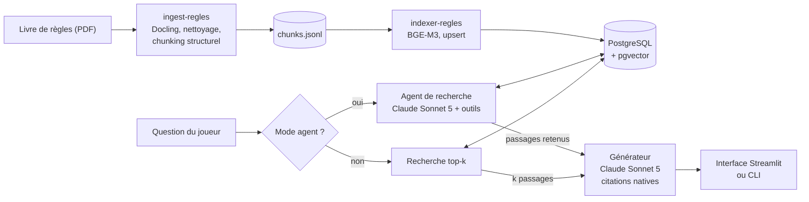

# Assistant de règles — Warhammer 40 000

Assistant conversationnel qui répond à des questions précises sur un corpus de règles, en s'appuyant **uniquement** sur ce corpus et en citant ses sources (code de règle, page).

**Version 1** : recherche documentaire (RAG) sur le livre de règles de base, agent de recherche qui reformule et explore le livre avant de répondre, génération avec citations natives, interface Streamlit, et évaluation sur un gold set de 100 questions.

## Le problème traité

De nombreuses organisations s'appuient sur des corpus de règles à deux niveaux : un socle général (réglementation, procédures, conditions générales) complété par des règles spécifiques qui le précisent ou y dérogent (dérogations sectorielles, avenants, procédures locales). Face à une situation concrète, l'utilisateur doit retrouver les règles applicables, comprendre comment elles s'articulent et déterminer laquelle prévaut.

Ce projet construit un assistant qui prend en charge ce raisonnement :

- l'utilisateur décrit sa situation et son doute en langage naturel, **avec ses propres mots** ;
- l'assistant retrouve les passages pertinents, y compris les exceptions rangées ailleurs que la règle générale ;
- il répond en citant chaque passage utilisé (code de règle, page) ;
- il répond « je ne trouve pas la réponse » lorsque le corpus ne permet pas de conclure, plutôt que d'inventer.

## Pourquoi Warhammer 40 000 ?

Pour rendre le projet plus concret qu'un cas d'école, le corpus retenu est celui du jeu de figurines Warhammer 40 000 (11e édition). Sa structure reproduit le problème ci-dessus :

| Cas générique              | Warhammer 40 000                       |
|----------------------------|----------------------------------------|
| Réglementation générale    | Règles de base                         |
| Dérogations spécifiques    | Règles propres à une armée             |
| Situation d'un usager      | Situation de jeu décrite par un joueur |

Deux difficultés rendent ce corpus intéressant :

- **Le vocabulaire.** Les joueurs n'emploient pas les termes du livre (« mes gars ont couru » pour une unité qui a *avancé*), et la bonne réponse combine souvent une règle générale et une exception décrite plus loin.
- **La date.** La 11e édition est sortie en juin 2026, après la date de fin d'entraînement de nombreux LLM, qui connaissent surtout l'édition précédente. Sans recherche documentaire, un modèle risque de mélanger les deux éditions avec assurance : c'est un bon terrain pour mesurer la fidélité des réponses au corpus.

La version 1 couvre le **livre de règles de base**. Les règles d'armée (le second niveau) sont prévues pour la version 2 : la base est déjà conçue pour accueillir plusieurs sources.

## Architecture



Le traitement d'une question se fait en **deux étapes aux rôles séparés** :

1. **Recherche.** En mode agent, un premier modèle reformule la question avec le vocabulaire du livre, lance plusieurs recherches, suit les renvois entre règles, puis **sélectionne** les passages utiles. Sans agent, la question brute sert directement à une recherche top-k.
2. **Génération.** Un second appel rédige la réponse **à partir de ces passages seulement**, avec des citations structurées fournies par l'API.

Séparer les deux rôles permet d'évaluer la recherche indépendamment de la génération, de réutiliser le même générateur dans les deux modes, et de lui transmettre un contexte trié plutôt que tout ce que l'agent a consulté.

## Choix techniques

| Composant | Choix | Pourquoi |
|---|---|---|
| Extraction du PDF | **Docling** (auto-hébergé) | Comprend la mise en page (colonnes, tableaux) ; données traitées en local |
| Découpage | Structurel : une sous-section de règle par passage, préfixée de son chemin (« Chapitre > Section > Sous-section ») | Un passage = une unité de règle cohérente, qui garde son contexte une fois isolée |
| Embeddings | **BGE-M3** (dense, 1024 dimensions), révision épinglée, fp16 sur GPU | Multilingue, solide en français ; vecteurs reproductibles |
| Base vectorielle | **PostgreSQL 18 + pgvector 0.8**, index HNSW cosinus, via Docker Compose | Une seule base pour vecteurs et métadonnées ; reconstructible en une commande |
| Génération | **Claude Sonnet 5**, effort `medium`, citations natives (blocs `search_result`), citations par paragraphe | Une citation ne peut désigner qu'un passage réellement fourni |
| Agent de recherche | **Claude Sonnet 5**, effort `high`, 3 outils : recherche, lecture d'une règle par code, sélection finale | La reformulation et l'exploration sont la partie difficile du raisonnement |
| Interface | **Streamlit** : chat en streaming, étapes de l'agent en direct, sources dépliables | Démonstration lisible du fonctionnement interne |
| Évaluation | Métriques de retrieval maison + **RAGAS** (juge Claude Haiku 4.5), visualisation plotly | Chaque brique ajoutée doit améliorer un chiffre |
| Tests | **pytest** ; intégration sur un PostgreSQL éphémère (**testcontainers**) | Tests rapides par défaut, tests lourds à la demande |

Les choix détaillés, leurs justifications et les écarts avec la spécification initiale sont décrits dans [`docs/specification-v1.md`](docs/specification-v1.md).

### Quelques décisions marquantes

- **Abstention vérifiable.** Le prompt impose une phrase d'abstention fixe, que le code vérifie au chargement et détecte dans les réponses : l'évaluation mesure automatiquement les abstentions justes et les fausses abstentions.
- **Traçabilité des prompts.** Chaque réponse porte le nom du prompt système et son empreinte (sha256) : on sait toujours quel texte a produit quelle réponse, même si le fichier a été modifié entre deux évaluations.
- **Garde-fou de modèle.** Chaque vecteur stocké porte l'identifiant du modèle qui l'a produit (nom et révision). La recherche refuse de démarrer si la base a été indexée avec un autre modèle : sans ce contrôle, les résultats seraient absurdes sans aucune erreur.
- **Indexation idempotente.** Upsert sur des identifiants déterministes et suppression des passages orphelins, par source et par édition, dans une seule transaction : relancer l'indexation après un changement de découpage ne laisse aucun passage périmé.
- **Sélection minimale de l'agent.** Si l'agent retient moins de passages que le minimum configuré, sa sélection est complétée avec les passages qu'il a consultés, sans modifier son ordre de priorité. Cela couvre les exceptions et précisions qu'il aurait écartées sur une question simple.

### Piste testée et non retenue

**Recherche plein texte comme outil de l'agent** ([notebook 09](notebooks/09_exploration_recherche_texte.ipynb)). Sur 16 requêtes en vocabulaire du livre, la recherche dense trouvait déjà le bon passage en tête dans la grande majorité des cas. La recherche plein texte n'apportait un gain net que sur une requête, et ajoutait surtout du bruit (règles longues et denses en mots-clés). Elle n'a pas été intégrée ; elle sera réévaluée si l'analyse des échecs montre des ratés liés à des termes exacts.

## Évaluation

L'évaluation compare plusieurs configurations sur un **gold set de 100 questions**, rédigées en langage de joueur et relues à la main. Chaque question porte ses références attendues (code de règle et/ou page), une réponse de référence et une catégorie (concepts de base, vocabulaire de joueur, règles proches, multi-sections, hors corpus…).

| Famille | Métriques |
|---|---|
| Retrieval | hit@1/3/5, hit@contexte, recall, MRR, référence citée |
| Génération (RAGAS, juge Claude Haiku) | faithfulness, answer relevancy, context precision, context recall |
| Comportement | abstention juste (hors corpus), fausse abstention, coût et durée par question |

**Résultats préliminaires** (gold set en cours de relecture finale) :

| Configuration | hit@5 | MRR | Faithfulness | Context recall | Abstention juste | Coût / question | Durée |
|---|---|---|---|---|---|---|---|
| Baseline (top-5, sans agent) | 0,94 | 0,76 | 0,78 | 0,73 | 1,00 | ~1,6 c$ | ~7,6 s |
| Agent (Sonnet 5, effort `high`) | *à mesurer* | | | | | | |

L'évaluation se trouve dans [`notebooks/08_evaluation.ipynb`](notebooks/08_evaluation.ipynb). Les résultats sont mis en cache par configuration et par question : relancer l'évaluation ne recalcule que ce qui manque.

## Installation

Prérequis :

- [uv](https://docs.astral.sh/uv/) et Docker (Engine + Compose) ;
- une clé API Anthropic ;
- vos propres exemplaires des documents de règles (voir *Données et propriété intellectuelle*) ;
- un GPU NVIDIA est recommandé pour l'ingestion et l'indexation, mais pas indispensable pour utiliser l'assistant.

Depuis la racine du repo :

```bash
git clone git@github.com:VictorCilleros/assistant-regles-w40k.git
cd assistant-regles-w40k
uv sync
cp .env.example .env    # renseigner ANTHROPIC_API_KEY et le mot de passe PostgreSQL
docker compose up -d    # PostgreSQL + pgvector
```

Placez le PDF des règles de base dans `data/core-rules/` (dossier ignoré par Git), et vérifiez son chemin dans `config/ingest/pipeline.yaml`.

## Utilisation

Depuis la racine du repo :

```bash
uv run ingest-regles        # PDF -> chunks.jsonl (Docling, nettoyage, découpage)
uv run indexer-regles       # chunks.jsonl -> embeddings -> PostgreSQL, avec contrôles
uv run interface-regles     # interface Streamlit
```

Commandes de diagnostic :

```bash
uv run chercher-regles "Les pistolets peuvent-ils tirer au corps à corps ?" -k 5 --complet
uv run repondre-regles "Les pistolets peuvent-ils tirer au corps à corps ?" --agent
uv run repondre-regles "…" --sans-agent
```

## Configuration

Tous les réglages sont dans des fichiers YAML validés au chargement : une clé mal orthographiée ou une valeur invalide est signalée immédiatement.

| Fichier | Contenu |
|---|---|
| `config/ingest/pipeline.yaml` | Chemins, options Docling, seuils de nettoyage, budget de découpage |
| `config/ingest/structure_livre.yaml` | Chapitres, sections et pages du livre |
| `config/rag/rag.yaml` | Modèle d'embedding, recherche (k), génération (modèle, effort, granularité, prompt), agent (modèle, effort, budget, `min_passages`) |
| `src/assistant_regles/rag/prompts/` | Prompts du générateur (`systeme_vf.md`) et de l'agent (`agent_vf.md`), relus à chaque question |
| `config/ui/` | Textes, apparence, registre des documents et page d'informations de l'interface |
| `.streamlit/config.toml` | Thème de l'interface (couleurs, polices) |
| `.env` | Clé API et connexion PostgreSQL (non versionné) |

## Structure du repo

```
assistant-regles-w40k/
├── compose.yaml                  # PostgreSQL + pgvector
├── config/                       # réglages YAML (ingest, rag, ui)
├── src/assistant_regles/
│   ├── ingest/                   # PDF -> chunks (parse, clean, chunk, pipeline)
│   ├── rag/
│   │   ├── embeddings.py         # encodeur BGE-M3
│   │   ├── store.py              # schéma, upsert, orphelins, contrôles
│   │   ├── pipeline.py           # commande indexer-regles
│   │   ├── recherche.py          # recherche top-k, lecture par code
│   │   ├── agent.py              # agent de recherche
│   │   ├── generation.py         # génération citée, streaming, commande repondre-regles
│   │   ├── prompts/              # prompts versionnés
│   │   └── sql/schema.sql
│   └── ui/                       # interface Streamlit
├── notebooks/                    # explorations (03 à 07, 09) et évaluation (08)
└── test/                         # tests pytest (ingest, rag, ui)
```

## Tests

Depuis la racine du repo :

```bash
uv run pytest                    # tests rapides : sans base, sans modèle, sans API
uv run pytest -m integration     # sur un PostgreSQL éphémère (Docker requis)
uv run pytest -m modele          # sur le vrai modèle BGE-M3
uv run pytest -m api             # sur la vraie API Anthropic (quelques centimes)
```

Les appels à l'API et au modèle sont remplacés par des doubles de test dans la suite par défaut. Les tests `api` vérifient le contrat réel de l'API (blocs `search_result`, citations, outils de l'agent) sur des règles fictives.

## Limites et suite

**Limites de la version 1 :**

- chaque question est traitée indépendamment : l'assistant ne tient pas compte des échanges précédents ;
- seul le livre de règles de base est indexé ;
- le mode agent est plus lent et plus coûteux que la recherche simple (plusieurs appels au modèle avant la réponse) ;
- Claude Sonnet 5 n'accepte pas de température fixe : deux exécutions d'une même évaluation peuvent légèrement différer.

**Version 2 envisagée :**

- historique de conversation (questions de suite reformulées par l'agent) ;
- règles d'armée, et raisonnement sur l'articulation entre règle générale et dérogation ;
- conteneurisation de l'application et intégration continue (GitHub Actions) ;
- recherche hybride ou reranking, seulement si l'évaluation montre un gain.

## Données et propriété intellectuelle

Les documents de règles utilisés pour développer et évaluer ce projet (11e édition, en français) ont été achetés par l'auteur. Protégés par le droit d'auteur, ils ne sont **pas** inclus dans ce dépôt, pas plus que les données qui en dérivent (découpages, embeddings, base vectorielle, gold set).

Ces documents servent uniquement à construire l'index de recherche documentaire : **aucun modèle n'est entraîné dessus**.

> Projet personnel non officiel, ni affilié à ni approuvé par Games Workshop. Warhammer 40,000 est une marque de Games Workshop Limited.

## Licence

Code distribué sous licence MIT (voir [LICENSE](LICENSE)). Cette licence couvre uniquement le code : elle ne s'applique pas aux documents de règles, qui restent la propriété de leurs ayants droit.
